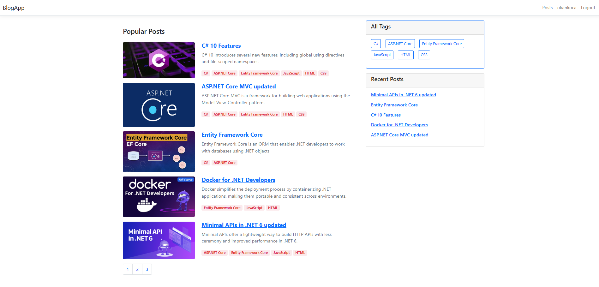
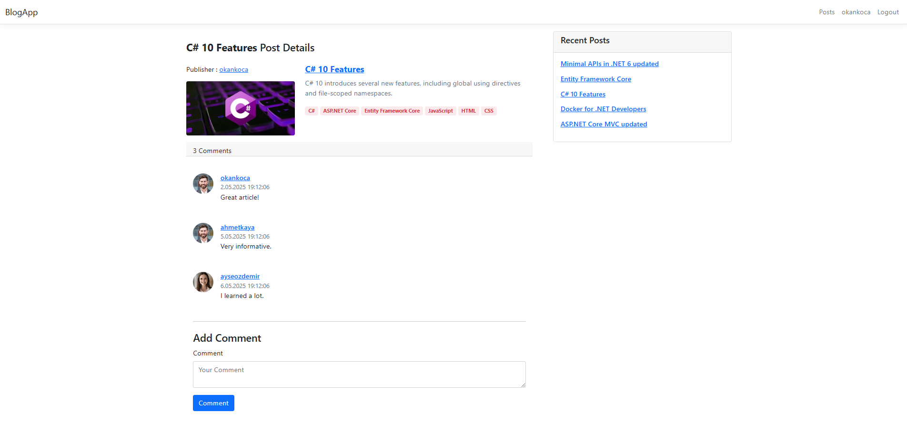
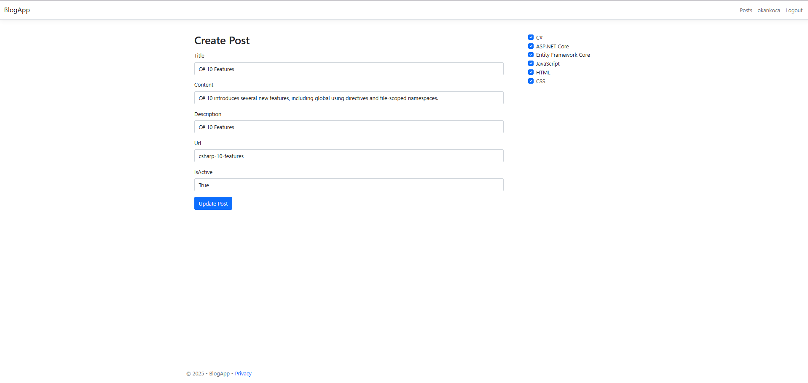
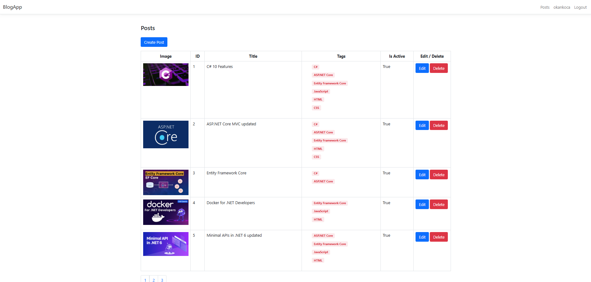
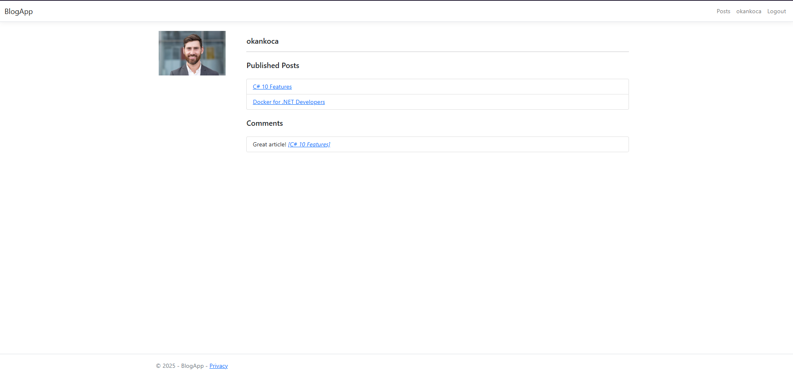

# 📝 BlogApp
BlogApp, ASP.NET Core MVC teknolojisi kullanılarak geliştirilen bir blog platformudur. Kullanıcılar blog gönderileri oluşturabilir, düzenleyebilir, yorum yapabilir ve içerikleri görüntüleyebilir. Uygulama ayrıca kullanıcı yönetimi, kategori sistemi ve modern arayüz bileşenleri ile zenginleştirilmiştir.

## 🚀 Kullanılan Teknolojiler
C# & ASP.NET Core MVC – Web uygulama framework ve kullanılan dil

Entity Framework Core – ORM ve veritabanı işlemleri

ASP.NET Core Identity – Kullanıcı kimlik doğrulama ve yetkilendirme sistemi

PostgreSQL Server – Veritabanı 

Bootstrap 5 – Duyarlı (responsive) kullanıcı arayüzü

Razor Pages

LINQ – Veri sorgulama işlemleri

Dependency Injection – Servis yönetimi

## 🔧 Uygulama Özellikleri
🔐 Kullanıcı kayıt, giriş ve çıkış işlemleri

✍️ Blog gönderisi oluşturma, düzenleme, silme

📂 Kategori(etiket) bazlı gönderi filtreleme

🧑‍💻 Yazar profilleri

🗂 Admin paneli ile içerik yönetimi

💬 Yorum sistemi (temel düzey)

📆 Yayın tarihi ile sıralama ve detay sayfaları

🧩 Temiz ve modern kullanıcı arayüzü

## 🖼️ Uygulama görselleri

